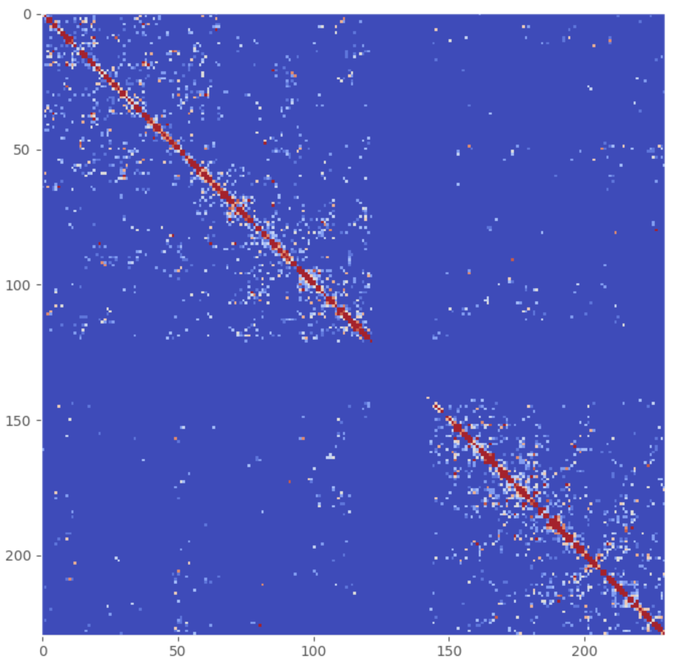
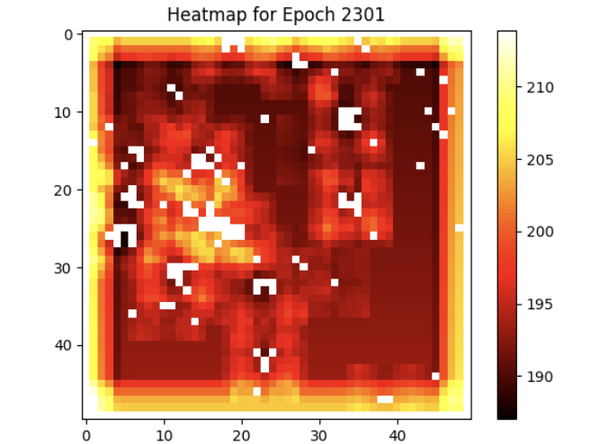

<h1>Heterogeneity of single-cell Hi-C DNA data Analysis</h1>

<strong>March 2024 - Present, University of Toronto, Toronto, Canada</strong>

<strong>Description:</strong> This research focuses on the heterogeneity of single-cell Hi-C DNA data to explore the quantitative methods for classifying different types of single cells based on DNA Hi-C data and contact matrices. Large amount of data cleaning and transformation is performed on the original dataset, different methods of dimension reduction are applied, including Principle Component Analysis, t-SNE, UMAP, with clustering techniques such as K-Means performed on lower dimension representations.

<strong>Supervisor:</strong> Professor. Elena Tuzhilina

<h1>Multi-agent LLM for Mental Health Diagnosis</h1>

<strong>April 2024 - August 2024, University of Toronto, Toronto, Canada</strong>

<strong>Description:</strong> This project involves the development of a multi-agent framework using LLMs to simulate a therapist's role in mental health diagnosis. The goal is to establish a framework that can mimic a therapist by interacting with users and analyzing responses to provide insights into their mental health. My contributions to this project included working on both the backend and frontend development, as well as the prompt engineering for the models. I also conducted experiments to evaluate the performance of the models and the overall system.

<strong>Supervisors:</strong> Bill Yuanhong Sun, Professor. Kang Lee

<a href="https://drive.google.com/file/d/1pGTPmJ7qZWFp33U70Gwz5icv3kAia4kr/view?usp=drive_link">Demo Video</a>

<h1>Multi-class Anxiety Prediction Approximation for Long Assessments</h1>

<strong>April 2024 - August 2024, University of Toronto, Toronto, Canada</strong>

<strong>Description:</strong> This project aims to create a multi-class anxiety prediction model to approximate long assessments.

<strong>Supervisors:</strong> Bill Yuanhong Sun, Professor. Kang Lee

<h1>Leaky Emotion in Social Psychology by Reinforcement Learning</h1>

<strong>September 2023 – May 2024, University of Toronto, Toronto, Canada</strong>

<strong>Description:</strong> This project researches how personal emotions affect other agents’ behavior in a social setting using reinforcement learning.

<strong>Supervisor:</strong> Professor. William Cunningham

<h1>Real-Life Data Modeling with the Modified Burr III Odds Ratio–G Distribution</h1>

<strong>September 2023 – May 2024, University of West Florida, Pensacola, USA</strong>

<strong>Description:</strong> This research presents the modified Burr III Odds Ratio–G distribution, a novel statistical model that integrates the odds ratio with the Burr III distribution. Focusing on the Burr III Scaled Inverse Odds Ratio–G (B-SIOR-G) subclass, this model enhances flexibility and predictive accuracy. The study explores the mathematical and statistical properties of the distribution, including hazard rates, quantiles, and moments. Rigorous simulations confirm the robustness of the B-SIOR-G model, and its application to four datasets demonstrates its superior efficacy compared to established distributions.

<strong>Supervisor:</strong> Professor. Shusen Pu

